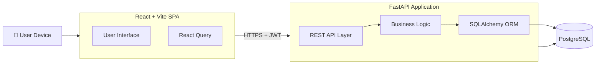
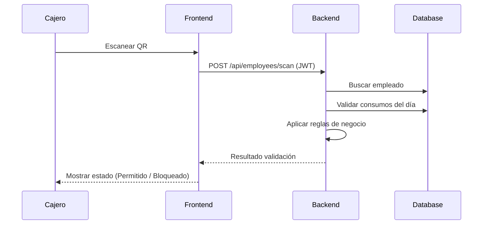
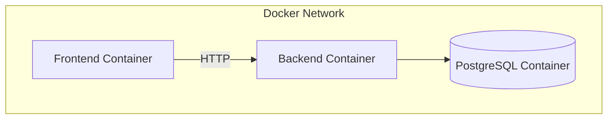

# 🍽️ F1 Comedor System

### Enterprise-Grade Food Consumption Management Platform


---

## 🚀 Overview

**F1 Comedor System** is a scalable, enterprise-ready platform designed to manage employee food consumption in corporate environments through QR-based identification, real-time validation, and robust business rules.

Built with a modern full-stack architecture, it ensures **high performance, security, and extensibility**.

---

## 🧭 System Architecture (C4 - Container Level)



---

## 🔄 Core Business Flow (QR Consumption)



---

## 🔐 Security Architecture

* **JWT Authentication (Access + Refresh Tokens)**
* Password hashing with **bcrypt**
* Protected endpoints via dependency injection
* Token-based stateless sessions
* Ready for:

  * OAuth2 integration
  * Role-Based Access Control (RBAC)

---

## 🧱 Technology Stack

### Frontend

* React (SPA)
* Vite (Build Tool)
* React Query (Server State Management)
* QR Scanner (html5-qrcode)

### Backend

* FastAPI (High-performance async API)
* SQLAlchemy (ORM)
* Pydantic (Data validation)
* JWT (Authentication)

### Database

* PostgreSQL (Relational DB)

### DevOps & Infra

* Docker
* Docker Compose
* Internal container networking

---

## 🐳 Deployment Architecture



---

## ⚙️ Local Development Setup

### 1. Clone Repository

```bash
git clone https://github.com/gproatechnology/GProA_F1.git
cd GProA_F1
```

---

### 2. Environment Variables

Create a `.env` file:

```env
POSTGRES_DB=f1comedor
POSTGRES_USER=f1comedor
POSTGRES_PASSWORD=securepassword

SECRET_KEY=supersecretkey
ALGORITHM=HS256
ACCESS_TOKEN_EXPIRE_MINUTES=30
```

---

### 3. Run with Docker

```bash
docker-compose up --build
```

---

### 4. Services Access

| Service     | URL                        |
| ----------- | -------------------------- |
| Frontend    | http://localhost:5173      |
| Backend API | http://localhost:8000      |
| API Docs    | http://localhost:8000/docs |

---

## 📁 Project Structure

```
.
├── frontend/                # React Application
│   └── src/
│       └── pages/
│
├── app/                     # Backend (FastAPI)
│   ├── api/                 # Endpoints
│   ├── services/            # Business logic
│   ├── models/              # ORM models
│   └── core/                # Config & security
│
├── docker-compose.yml
└── README.md
```

---

## 📊 Domain Model

Core entities:

* **User** → Authentication
* **Employee** → Consumer identity
* **Consumption** → Transactions
* **Company** → Organizational unit
* **Category** → Rules & limits

---

## 🎯 Business Rules Engine

The system enforces:

* Employee must be **active**
* Company must be **active**
* Category must be **active**
* Daily consumption must not exceed limit

```python
can_consume = (
    employee.is_active and
    company.is_active and
    category.is_active and
    consumptions_today < category.daily_limit
)
```

---

## 🔌 API Design

RESTful structure:

### Authentication

```
POST /api/auth/login
POST /api/auth/refresh
```

### Employees

```
POST /api/employees/scan
GET  /api/employees/
```

### Consumptions

```
POST /api/consumptions/
```

### Reports

```
GET /api/reports/
```

---

## 📈 Scalability Considerations

* Stateless backend (horizontal scaling ready)
* Database indexing for high-frequency queries
* Service-layer abstraction for microservices migration
* Ready for:

  * Load balancers
  * API gateways
  * Caching (Redis)

---

## 🔭 Future Enhancements

* RBAC (Role-Based Access Control)
* Multi-tenant architecture
* Real-time events (WebSockets)
* BI dashboards
* Exportable reports (PDF/Excel)
* Mobile app (React Native)

---

## 🧪 Testing Strategy (Recommended)

* Unit tests (services)
* Integration tests (API endpoints)
* E2E tests (user flows)

Tools:

* Pytest
* Postman / Newman

---

## 🚀 CI/CD (Suggested)

* GitHub Actions
* Docker image build & push
* Automated testing pipeline
* Deployment to:

  * AWS / GCP / Azure
  * VPS (DigitalOcean, etc.)

---

## 👨‍💻 Author

**GProA Technology**

---

## 📄 License

MIT License

---

## 🤝 Contributing

1. Fork the repository
2. Create a feature branch
3. Commit your changes
4. Open a Pull Request

---

## 💡 Final Notes

This system is designed with **enterprise-grade architecture principles**, ensuring:

* Clean separation of concerns
* Maintainability
* Scalability
* Security

Ready to evolve into a full SaaS platform 🚀
