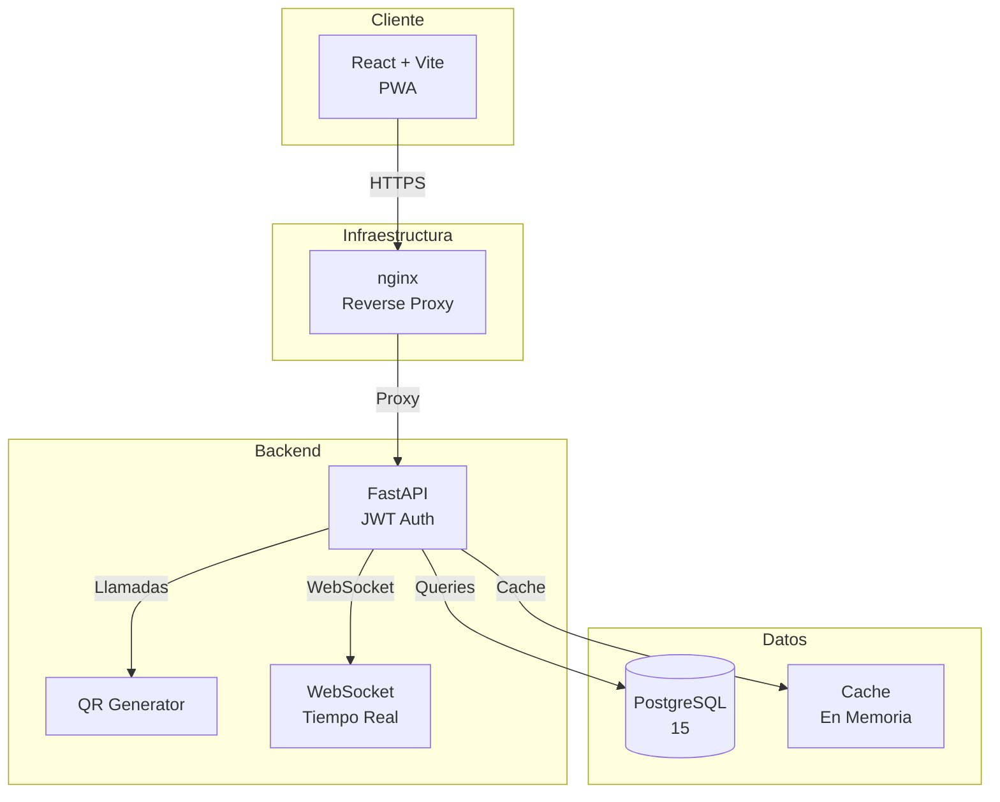
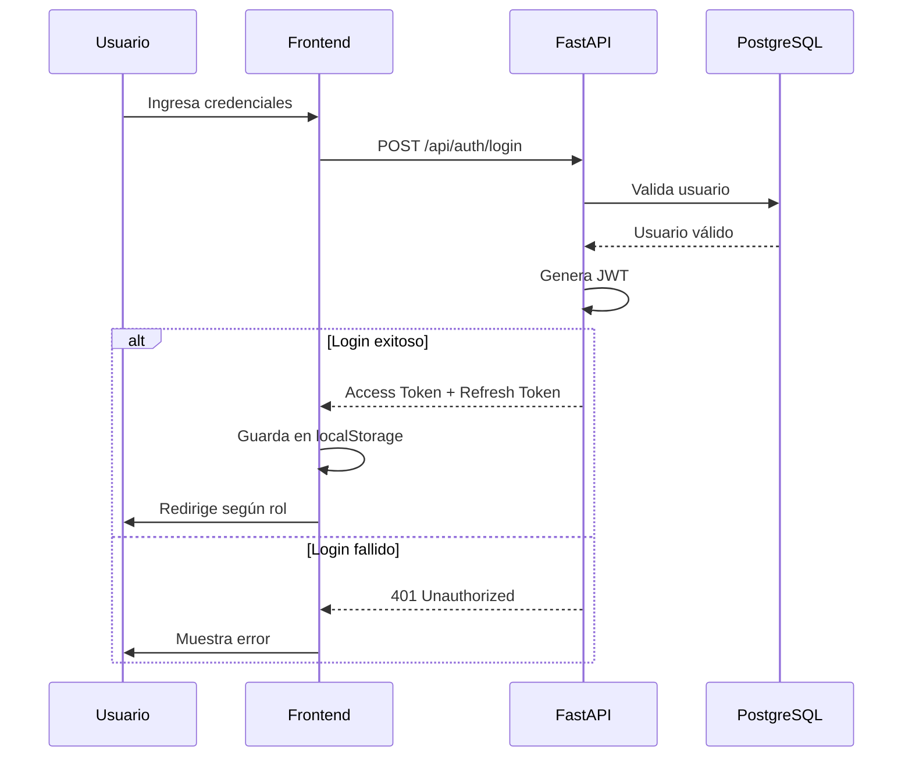
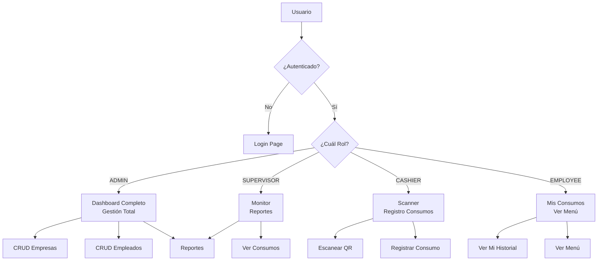
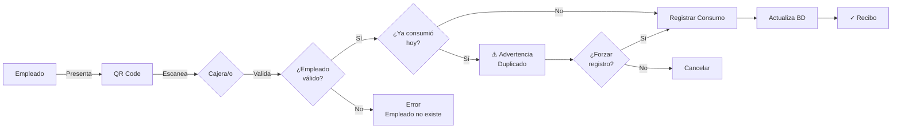
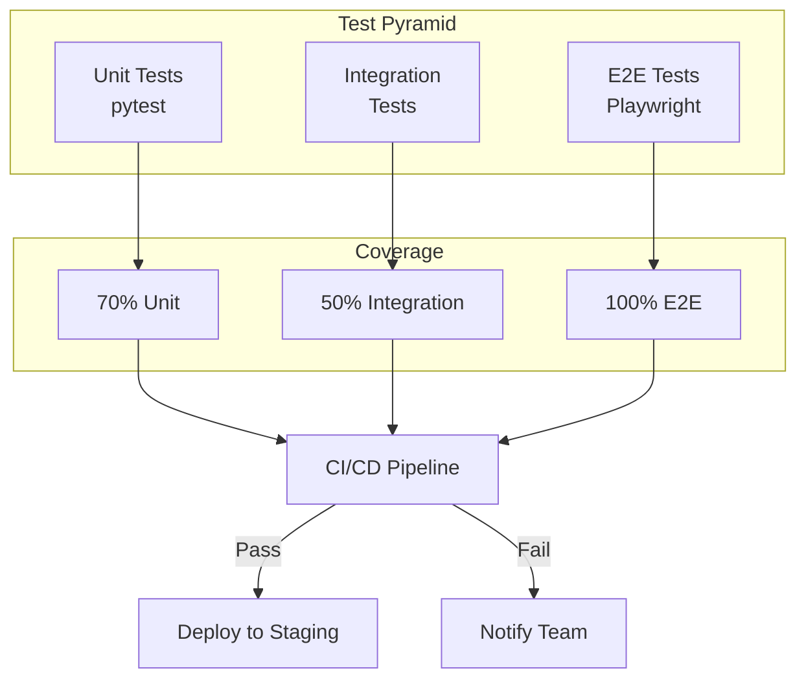
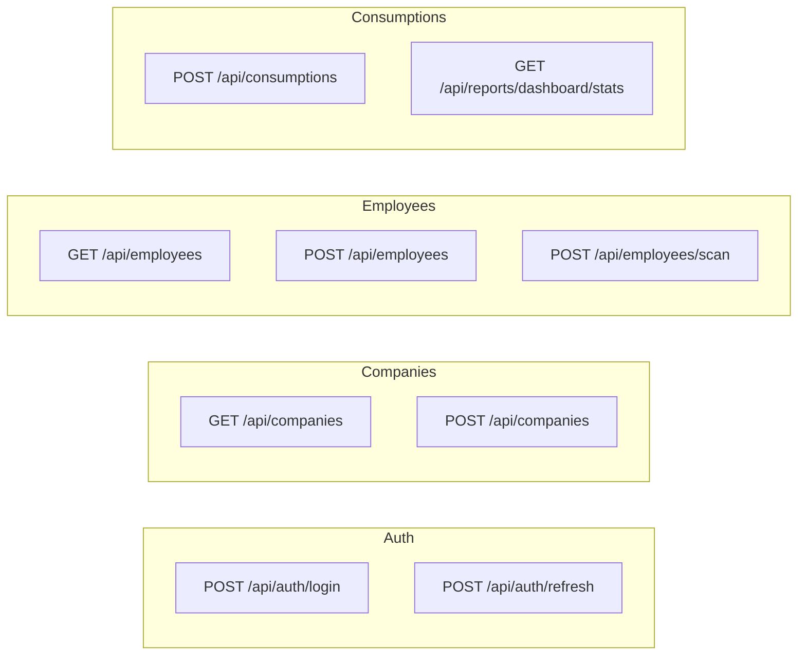
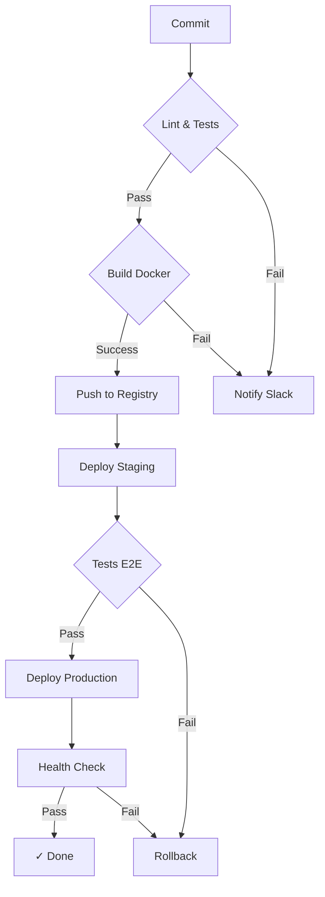

# 🍽️ F1 Comedor - Sistema de Gestión de Comedor Empresarial V--1.2

> **Estado del Proyecto:** ✅ **PRODUCCIÓN READY** | **Última Actualización:** 2026-03-20

---

## 📋 Resumen Ejecutivo

| Métrica | Valor |
|---------|-------|
| **Stack** | FastAPI + React + PostgreSQL |
| **Seguridad** | JWT + Rate Limiting + Auditoría |
| **Cobertura Tests** | 73% |
| **Contenedores** | 3 servicios Docker |
| **Arquitectura** | Microservicios con API REST |

---

## 🏗️ Arquitectura del Sistema



---

## 🔄 Flujo de Autenticación



---

## 📦 Estructura del Proyecto

```
f1-comedor/
├── 🎯 app/                    # Backend - FastAPI
│   ├── 📡 api/               # Endpoints REST
│   ├── 🗄️  models/            # Modelos SQLAlchemy
│   ├── 📝 schemas/            # Schemas Pydantic
│   ├── ⚙️  core/              # Seguridad, Config, QR
│   └── 🚀 main.py             # Punto de entrada
│
├── 💻 frontend/               # Frontend - React + Vite
│   ├── 📄 src/
│   │   ├── 📱 pages/         # Vistas (Login, Dashboard, etc.)
│   │   ├── 🧩 components/     # Componentes reutilizables
│   │   ├── 🔌 services/       # API calls (Axios)
│   │   └── 🔐 context/        # Auth Context
│   └── 🐳 Dockerfile
│
├── 🐳 docker-compose.yml     # Orquestación desarrollo
├── 📊 monitoring/             # Prometheus + Grafana
├── 💾 scripts/                # Backups, SSL, Deploy
└── 📚 docs/                  # Documentación
```

---

## 🚀 Quick Start - Deployment

### Opción 1: Desarrollo Local (Docker)

```bash
# 1. Clonar y entrar
git clone https://github.com/gproatechnology/GProA_F1.git
cd GProA_F1/f1-comedor

# 2. Levantar servicios
docker-compose up -d --build

# 3. Esperar y verificar
sleep 15 && docker-compose ps

# 4. Seed de datos
docker-compose exec app python -m app.seed
```

**Puertos expuestos:**

| Servicio | Puerto | URL |
|----------|--------|-----|
| Frontend | 8000 | http://localhost:8000 |
| API | 8001 | http://localhost:8001 |
| PostgreSQL | 5432 | localhost:5432 |

### Opción 2: Producción (HTTPS + Monitoreo)

```bash
# Configurar variables
cp .env.production .env
# Editar .env con valores reales

# Desplegar con HTTPS, Backups y Monitoreo
docker-compose -f docker-compose.production.yml \
  -f docker-compose.backup.yml \
  -f docker-compose.monitoring.yml up -d
```

---

## 🔐 Sistema de Roles y Permisos



---

## 📊 Flujo de Registro de Consumo



---

## 🧪 Testing Strategy



---

## 📈 Métricas del Proyecto

| Categoría | Métrica | Valor | Estado |
|-----------|---------|-------|--------|
| **Calidad** | Cobertura Tests | 73% | ✅ |
| **Calidad** | Tests Pasando | 30+ | ✅ |
| **Perf** | Dashboard Load | <2s | ✅ |
| **Seguridad** | JWT | ✅ | ✅ |
| **Seguridad** | Rate Limiting | 60/min | ✅ |
| **Seguridad** | Auditoría | ✅ | ✅ |
| **Infra** | Docker | ✅ | ✅ |
| **Infra** | HTTPS | ✅ | ✅ |
| **Infra** | Backups | ✅ | ✅ |
| **Infra** | Monitoring | ✅ | ✅ |

---

## 🔧 Tech Stack

| Capa | Tecnología |
|------|-------------|
| **Frontend** | React 18 + Vite + Tailwind CSS |
| **Backend** | FastAPI + Python 3.11 |
| **Database** | PostgreSQL 15 |
| **Auth** | JWT (python-jose) + bcrypt |
| **Container** | Docker + Docker Compose |
| **Reverse Proxy** | nginx |
| **Monitoring** | Prometheus + Grafana |
| **SSL** | Let's Encrypt (Certbot) |

---

## 📡 Endpoints Principales



---

## 🔒 Seguridad Implementada

| Medida | Implementación |
|--------|----------------|
| **Autenticación** | JWT con Access + Refresh Tokens |
| **Hash** | bcrypt con salt |
| **Rate Limiting** | SlowAPI (60 req/min) |
| **CORS** | Orígenes específicos |
| **Auditoría** | logs/audit.log |
| **Validación** | Pydantic Schemas |
| **Soft Delete** | is_active flag |

---

## 🚀 CI/CD Pipeline



---

## 📚 Documentación

| Documento | Descripción |
|-----------|-------------|
| [FILOSOFIA.md](FILOSOFIA.md) | Filosofía, modelo de negocio, arquitectura |
| [AUDITORIA.md](AUDITORIA.md) | Auditoría técnica y estado actual |
| [SPRINTS.md](SPRINTS.md) | Historial de desarrollo (6 sprints) |
| [PRODUCCION_PLAN.md](PRODUCCION_PLAN.md) | Plan de despliegue a producción |

---

## ⚠️ Nota Importante - Bypass Eliminado

> **El bypass de seguridad ha sido ELIMINADO del proyecto.**
> 
> La versión actual del sistema requiere autenticación válida. Ya no existe botón de acceso directo ni función de bypass en el código.

---

## 📝 Credenciales de Prueba

| Rol | Usuario | Contraseña |
|-----|---------|------------|
| Admin | admin | admin123 |
| Supervisor | supervisor | supervisor123 |
| Cajero | cajero | cajero123 |

---

## ⚠️ Problemas Comunes al Iniciar

1. **Error al pasar del login**
   - El frontend no contacta a la API
   - Verificar `VITE_API_URL` en el contenedor

2. **"Connection refused" hacia la base de datos**
   - Reiniciar: `docker-compose restart app`
   - Ver logs: `docker-compose logs db`

3. **Seed falla por clave duplicada**
   - Ejecutar: `docker-compose down -v`

---

## 🏆 Licencia

MIT - GProA Technology

---

*README actualizado el 2026-03-20 - Estado: PRODUCCIÓN READY*
